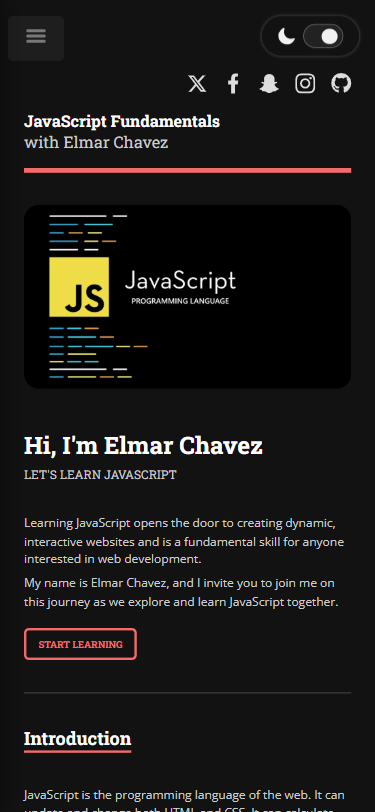

# 💻 W3Schools JS Tutorial Clone Site

## ℹ️ JavaScript Fundamentals: A W3Schools JS Tutorials Clone Site

| _Mobile Preview (375x812)_                            | _Desktop Preview (1440x960)_                             |
| ----------------------------------------------------- | -------------------------------------------------------- |
|       |       |
|  |  |

This is a complete educational website that mirrors the JavaScript tutorials section of [W3Schools.com](https://www.w3schools.com/js/). It includes structured lessons, live interactive demo buttons, code tables, a responsive layout, theme toggling, and some quirky utilities like tracking the days since I started learning frontend.

---

## 🔍 Overview

This project is a full educational clone of the W3Schools JavaScript tutorial section. It features a sidebar with navigation, collapsible content sections, interactive code examples, and visually enhanced demos to mimic real-world documentation.

I created this project from scratch using only HTML, CSS, and JavaScript to reinforce my understanding of JS topics while also practicing DOM manipulation, styling, layout, and accessibility features. This is my longest and challenging project yet.

---

## ✨ Features

- Fully responsive and mobile-first layout
- Dark/Light theme toggle (saved in local storage)
- Accessible semantic HTML5 structure
- Interactive live JS demos with buttons and visual feedback
- Sidebar menu with scroll-spy highlight and collapse on click
- Daily footer greeting and time-aware dynamic content
- Animated quote generator with 100+ motivational quotes
- Custom color themes using CSS variables
- Google Lighthouse performance tested

---

## 🧠 What I Learned

- Learned the basics of JavaScript while building this site
- DOM manipulation and event listeners
- Theme toggling with `classList` and `localStorage`
- Accessibility practices using semantic tags and hidden elements
- Creating dynamic content like date/time-based greetings
- JavaScript fundamentals like functions, objects, arrays, operators
- Scroll behavior and section highlighting logic
- How to write modular and reusable functions for interactivity
- Deepened understanding of layout using `flexbox` and media queries

---

## 🛠️ Tech Used

- HTML5
- CSS3
- JavaScript
- Git
- GitHub
- Netlify

---

## 🚀 How to Run

1. Clone the repository
2. Open `index.html` in your browser

---

## 🌐 Live Demo

Or you can check out the 👉 [live website here](https://javascript-fundamentals-jiro.netlify.app/)

---

## 📊 Performance Report

A **Google Lighthouse** audit was conducted on the final version of this project. You can view the full report [here](./downloads/lighthouse-performance-report.pdf).

---

## 🧑‍💻 Author

Created by **Elmar Chavez**

🗓️ Month/Year: **June - July 2025**

📚 Journey: **3rd - 4th** month of learning _frontend web development_.
